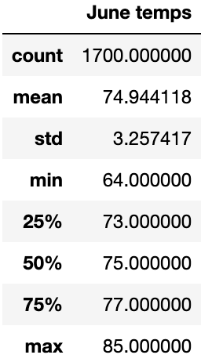
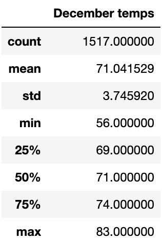

# surfs_up
Weather data analysis to build a Surf and Shake Store in  Hawaii 
## Overview
The purpose of this project is to build a weather data analysis focus on June and December weather to understand how this can affect the success of a Surf and Shake store in Hawaii.
## Results
Here is the summary statistics of June temperatures
.

Here is the summary statistics of December temperatures
.

- According to the statistical analysis, it is possible to observe that the temperatures in June and December are similar and very stable, even though the two are in different seasons.
- The average temperature in June is around 74 degrees Fahrenheit, and in December, it is 71 degrees Fahrenheit, not having a significant temperature variation, which favours the success of the Surf and Shakes store, as temperature variation will not affect sales of shakes and looking for board rentals.
- Also, analyzing the maximum and minimum temperatures, there is no difference in the maximum. June is 85, and December is 83. However, studying the minimum is where we enter attention data. As previously said, December is in the inverse season; what is expected is a colder temperature, so the minimum is at 53 degrees and in June, it is at 64.

## Summary 

## Resources
- Data: hawaii.sqlite
- Source: Pandas, Jupyter 
